# Game of Life Conway's
[](#)
[](#)

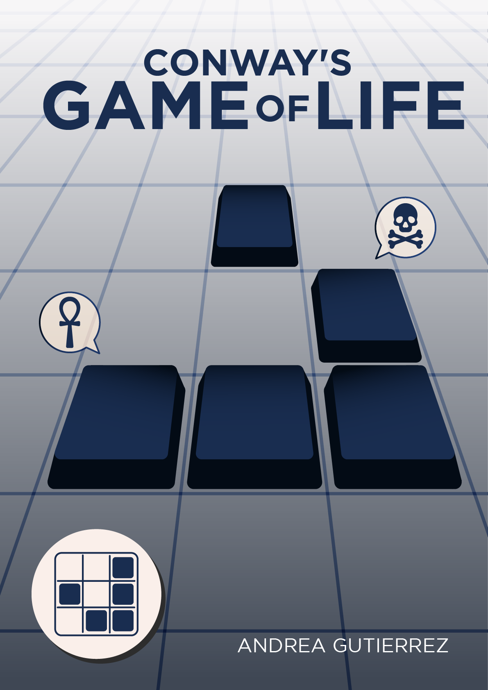

[](#)
# **El Juego de la Vida de Conway**

## Descripción del Proyecto

Este proyecto es una implementación del **Juego de la Vida** de Conway en Java. Utiliza una cuadrícula de células que evolucionan a través de generaciones según reglas simples. El estado de cada célula en la siguiente generación depende de las células vecinas. El juego permite personalizar las configuraciones como el tamaño de la cuadrícula, la población inicial, el número de generaciones y la velocidad de la simulación. Se ejecuta a través de la línea de comandos, proporcionando una experiencia interactiva para observar cómo las células evolucionan con el tiempo.

### Características

- **Simulación de generaciones**: Genera nuevas configuraciones de células basadas en reglas del Juego de la Vida.
- **Configuración de la Población Inicial**: Puedes establecer la población inicial mediante un string o generar una aleatoria.
- **Configuración de Parámetros**: Desde la CLI, puedes definir el ancho y alto de la cuadrícula, el número de generaciones, la velocidad entre generaciones y la población inicial.
- **Variedad en vecindarios**: Soporta diferentes tipos de vecindarios como Von Neumann, Hexagonal Diagonal, Moore, etc.
- **Salida visual en consola**: Muestra el estado de cada generación con colores para representar las células vivas y muertas.

## Requisitos Previos

- Java 17

## Instalación

1. Clona el repositorio:

    ```bash
    git clone https://github.com/GutBla/PROJECT_Game_of_Life.git
    ```

2. Accede al directorio del proyecto:

    ```bash
    cd PROJECT_Game_of_Life
    ```

3. Asegúrate de tener Java 17 o superior instalado.

## Uso

Para ejecutar el proyecto, utiliza la línea de comandos (CLI) con los siguientes parámetros de configuración:

- `w=<ancho>`: Ancho de la cuadrícula (opciones: 10, 20, 40, 80).
- `h=<alto>`: Alto de la cuadrícula (opciones: 10, 20, 40).
- `g=<generaciones>`: Número de generaciones a simular (un número positivo).
- `s=<velocidad>`: Velocidad de la simulación en milisegundos por generación (entre 250 y 1000).
- `p=<población>`: Población inicial (puede ser `rnd` para aleatorio o una cadena de `1`s y `0`s representando células vivas y muertas).
- `n=<tipoVecindario>`: Tipo de vecindario (1: Von Neumann, 2: Hexagonal Diagonal, 3: Moore, 4: Reverse Von Neumann, 5: Parallels).

Para iniciar la simulación, ejecuta el siguiente comando en la línea de comandos, pasando los parámetros de configuración:

```bash
java Main w=40 h=20 g=100 s=500 p=rnd n=3
```

Esto iniciará el juego con una cuadrícula de 40x20, 100 generaciones, velocidad de 500 ms por generación, población aleatoria y un vecindario tipo Moore.

El proyecto se ejecuta desde el archivo **Main.java**. La simulación de generaciones comenzará una vez que se validen los parámetros.

## ¿Qué es el Juego de la Vida?

El Juego de la Vida es un autómata celular, un sistema que evoluciona a través de una serie de generaciones aplicando reglas simples sobre una malla de celdas. Fue creado por el matemático John Horton Conway en 1970 como un experimento para observar cómo pueden surgir patrones complejos y comportamiento emergente a partir de reglas muy simples. A pesar de ser solo un juego, ha demostrado tener relevancia en matemáticas, biología, y ciencias de la computación, e incluso se ha comprobado que tiene la capacidad de simular una máquina de Turing, lo que lo convierte en un modelo universal de computación.

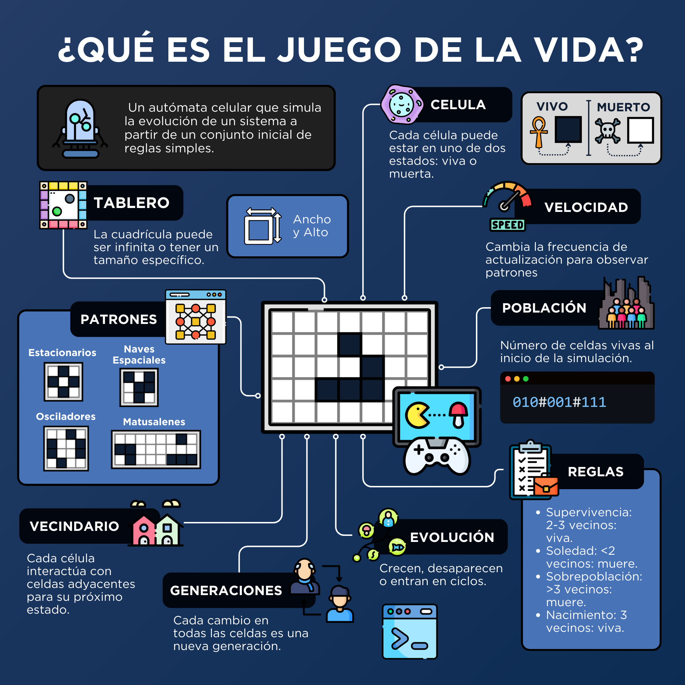

### Representación Celular

- Una **celda muerta** se representa con el símbolo ☐ o con el número `0`.
- Una **celda viva** se representa con el símbolo ■ o con el número `1`.

## Historia

El Juego de la Vida, creado por el matemático británico John Horton Conway, fue presentado al mundo en octubre de 1970 a través de la columna de juegos matemáticos de Martin Gardner en la revista Scientific American. Conway estaba interesado en demostrar cómo reglas simples pueden generar patrones complejos sin necesidad de intervención externa. Este juego, que utiliza una cuadrícula de celdas que pueden estar vivas o muertas, se rige por reglas básicas que determinan su evolución. Rápidamente, el Juego de la Vida capturó la imaginación de muchos y se convirtió en un tema central en el estudio de sistemas dinámicos y complejos. Su influencia se ha extendido a áreas como la teoría de autómatas celulares, la computación teórica y la biología, mostrando cómo la simplicidad puede dar lugar a una sorprendente complejidad.


## Reglas del Juego de la Vida

El juego transcurre en una malla de celdas, donde cada celda puede estar en uno de dos estados: viva o muerta. La evolución del sistema se rige por cuatro reglas que determinan cómo una celda cambiará de estado en la siguiente generación.

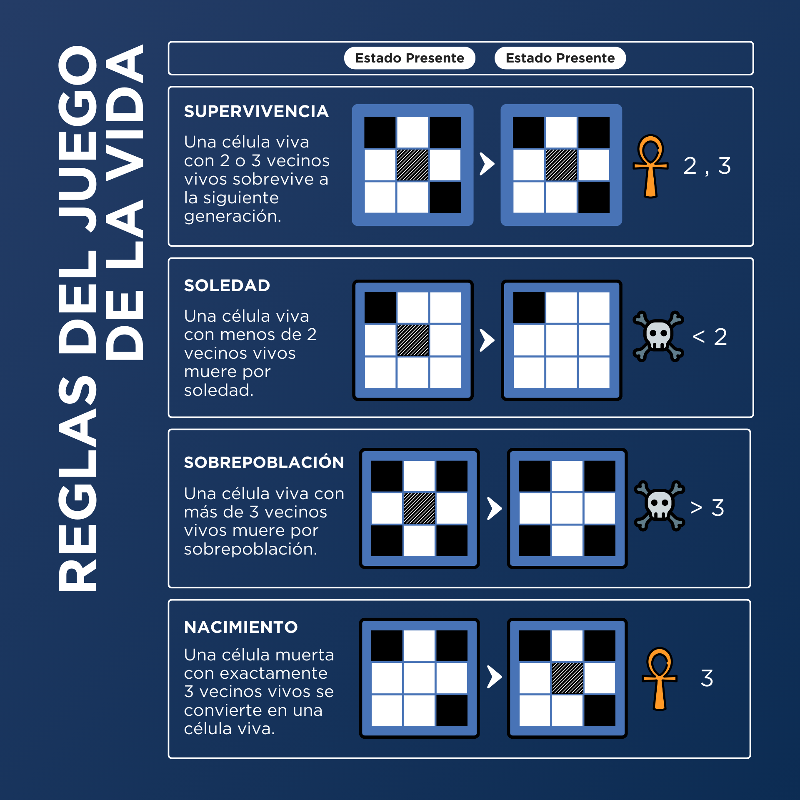

### Las Cuatro Reglas del Juego de la Vida

1. **Supervivencia:**
    - Una celda que está viva en la generación actual permanece viva en la siguiente generación si tiene **dos o tres vecinos vivos**. De lo contrario, muere por superpoblación o soledad.
2. **Muerte por Soledad:**
    - Una celda viva con **menos de dos vecinos vivos** muere en la siguiente generación.
3. **Muerte por Superpoblación:**
    - Una celda viva con **más de tres vecinos vivos** muere en la siguiente generación.
4. **Reproducción:**
    - Una celda muerta se convertirá en viva si tiene **exactamente tres vecinos vivos**.

## Tablero

El juego ocurre en un tablero bidimensional compuesto por una cuadrícula de celdas. Cada celda tiene un estado (viva o muerta) y su estado en cada turno está influenciado por las celdas vecinas.

### Ancho (w) y Altura (h)

El ancho (w) y la altura (h) determinan el tamaño de la cuadrícula en la que ocurre la simulación. Aunque teóricamente el tablero puede ser infinito, muchas implementaciones usan un tablero de tamaño finito para visualizar mejor el comportamiento.

> [!WARNING]
Ancho (w):
> 
> - **Valores Válidos:** 10, 20, 40.
> - **Validación:** Si el ancho no es uno de estos valores, se considera **inválido**.

> [!WARNING]
Altura (h):
> 
> - **Valores Válidos:** 10, 20, 40.
> - **Validación:** Si la altura no es uno de estos valores, se considera **inválida**.

```python
w = 10
w = 20
w = 40
w = 80

h = 10
h = 20
h = 40
```

## ¿Qué son las Generaciones (g)?

El tiempo en el Juego de la Vida se mide en **generaciones**. Cada generación corresponde a una actualización completa de todas las celdas del tablero, aplicando las reglas a cada una de ellas en paralelo. La **generación** puede ser cualquier cantidad. Si **g = 0**, significa que las generaciones son infinitas.

```python
g = 10
g = 50
g = 100
g = 500
g = 1000
g = 0  # Infinito
```

## ¿Qué es la Velocidad (s)?

La velocidad define con qué rapidez se avanza de una generación a la siguiente. En la mayoría de las simulaciones visuales, la velocidad es ajustable para que el observador pueda ver cómo los patrones evolucionan en tiempo real o de manera pausada. Una velocidad rápida (s alto) permite ver grandes patrones evolucionar, mientras que una velocidad más lenta (s bajo) es útil para analizar patrones detalladamente.

> [!WARNING]
Velocidad (s):
> 
> - **Rango Válido:** Debe ser un número entre 250 y 1000 milisegundos por generación.
> - **Validación:** Si la velocidad no está dentro de este rango, se considera **inválida**.

## ¿Qué son los Vecindarios (n)?

El vecindario de una celda es clave en su evolución. Existen diferentes tipos de vecindarios que influyen en cómo las celdas interactúan entre sí. Algunos de los tipos más comunes son:

- **Von Neumann**: Considera las celdas adyacentes en las direcciones cardinales (arriba, abajo, izquierda, derecha).
- **Hexagonal Diagonal**: Considera las celdas en forma hexagonal.
- **Moore**: Considera las celdas adyacentes en las ocho direcciones (incluyendo las diagonales).
- **Reverse Von Neumann**: Similar a Von Neumann, pero con las interacciones invertidas.
- **Parallels**: Las celdas interactúan solo con las de líneas o columnas paralelas.

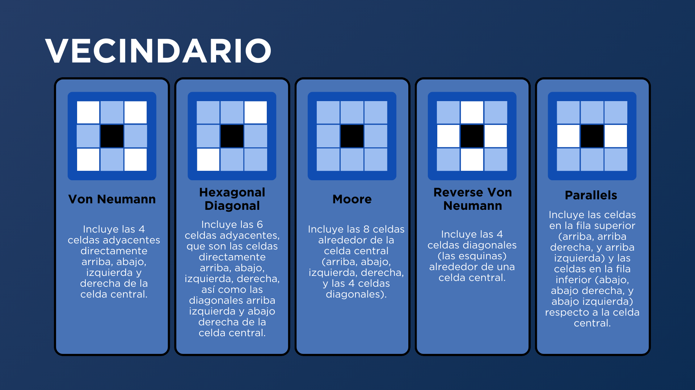

> [!WARNING]
Vecindario (n):
> 
> - **Valores Válidos:** 1, 2, 3, 4, 5.
> - **Validación:** Si el vecindario no es uno de estos valores, se considera **inválido**.

## Tipos de Patrones

Los patrones en el Juego de la Vida se clasifican en función de su comportamiento a lo largo de las generaciones. Aquí se presentan las definiciones ampliadas de cada tipo de patrón:

### **Patrones Estacionarios (Still-Lifes)**

Los patrones estacionarios son estructuras que permanecen inalteradas a lo largo del tiempo. No cambian con cada generación y se consideran estables. Estos patrones no sufren modificaciones a lo largo de la simulación.

- **Bloque**
    
    ```java
    p="#0110#0110"
    ```
    
- **Colmena de Abejas**
    
    ```java
    p="#001100#010010#001100"
    ```
    
- **Pa**
    
    ```java
    p="#01100#01010#00100"
    ```
    
- **Bote**
    
    ```java
    p="#001100#010010#001010#000100"
    ```
    
- **Bañera**
    
    ```java
    p="#00100#01010#00100"
    ```
    

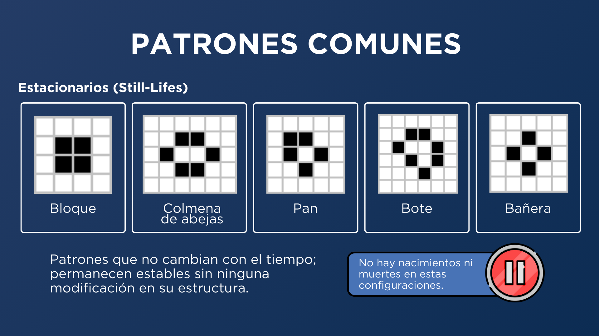

### **Patrones Osciladores**

Los patrones osciladores cambian de forma en una serie de ciclos o repeticiones. Estos patrones alternan entre dos o más estados a medida que avanzan las generaciones.

- **Pulsar**
    
    ```java
    p="#00000100000100000#00000100000100000#00000110001100000##01110011011001110#00010101010101000#00000110001100000##00000110001100000#00010101010101000#01110011011001110##00000110001100000#00000100000100000#00000100000100000"
    ```
    
- **Penta-decation**
    
    ```java
    p="###00001110000#00000100000#00000100000#00001110000##00001110000#00001110000##00001110000#00000100000#00000100000#00001110000##"
    ```
    
- **Intermitente**
    
    ```java
    p="##01110#"
    ```
    
- **Sapo**
    
    ```java
    p="##001110#011100#"
    ```
    
- **Faro**
    
    ```java
    p="#011000#010000#000010#000110"
    ```
    

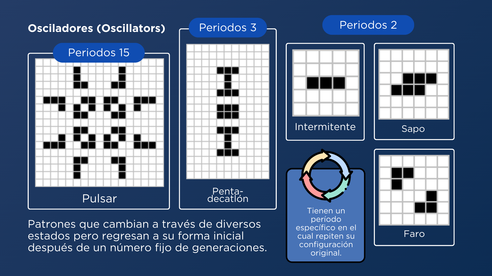

### **Patrones Naves Espaciales**

Las naves espaciales son patrones que se mueven a través del tablero. Estos patrones se desplazan en una dirección determinada a medida que avanza cada generación.

- **Planeador**
    
    ```java
    p="#00100#00010#01110"
    ```
    
- **Nave espacial ligera**
    
    ```java
    p="#0100100#0000010#0100010#0011110"
    ```
    
- **Nave espacial peso medio**
    
    ```java
    p="#00111110#01000010#00000010#01000100#00010000"
    ```
    
- **Nave espacial pesada**
    
    ```java
    p="#001111110#010000010#000000010#010000100#000110000"
    ```
    

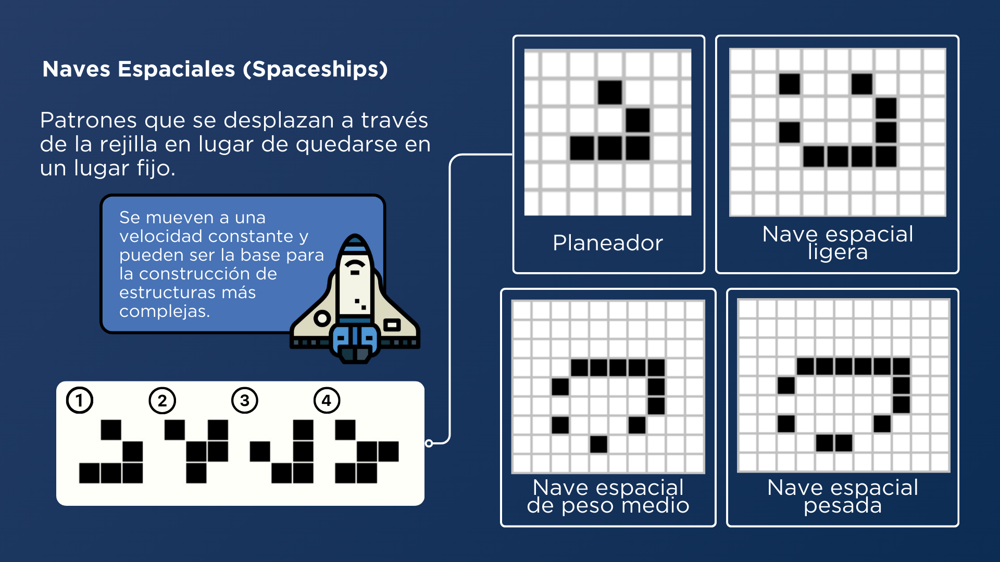

### **Patrones Generadores**

Los patrones generadores crean nuevos patrones a partir de su estructura a lo largo del tiempo. Estos patrones son capaces de generar otros patrones vivos en el tablero.

- **Cañón de planeadores de Gosper:** Un patrón muy famoso que genera una serie de planeadores que se desplazan a través del tablero. Es conocido por ser uno de los primeros patrones que demostró la capacidad de crear estructuras complejas en el Juego de la Vida.
    
    ```java
    p="000000000000000000000000100000000000#000000000000000000000010100000000000#000000000000110000001100000000000011#000000000001000100001100000000000011#110000000010000010001100000000000000#110000000010001011000010100000000000#000000000010000010000000100000000000#000000000001000100000000000000000000#000000000000110000000000000000000000"
    ```
    

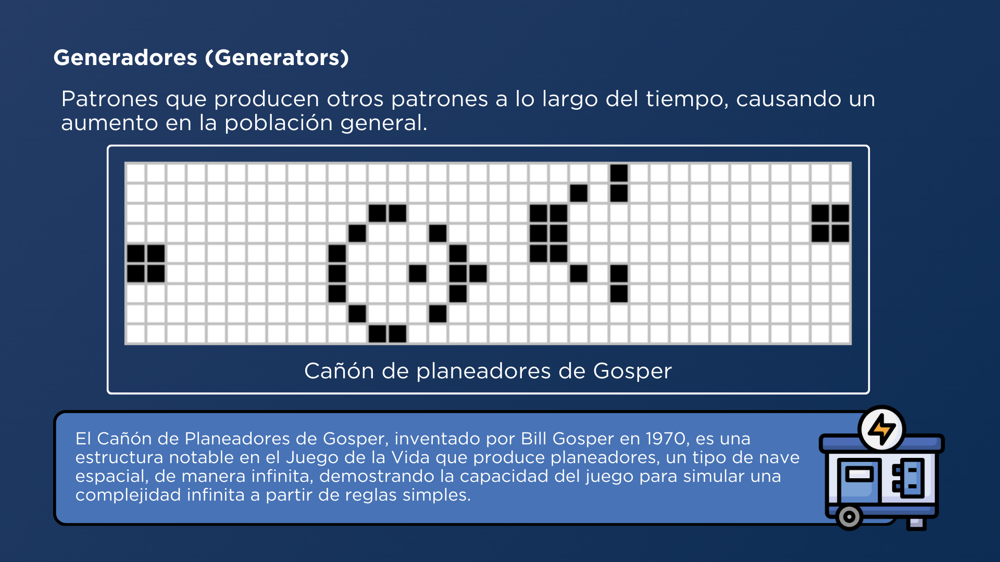

### **Patrones Matusalén**

Los patrones matusalén son estructuras que tardan muchas generaciones en alcanzar un estado estable. Estos patrones pueden pasar por una serie de transformaciones antes de estabilizarse.

- **Difícil de Matar**
    
    ```java
    p="00000010#11000000#01000111"
    ```
    
- **Bellota**
    
    ```java
    p="00100000#00001000#11000111"
    ```
    
- **R=pentomino**
    
    ```java
    p="#00110#01100#00100"
    ```
    

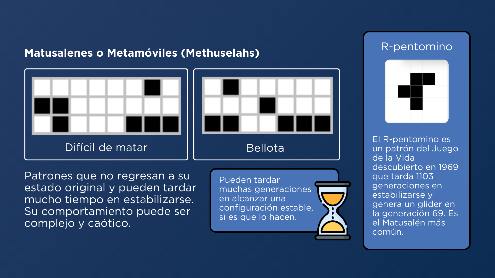

### **Patrones Crecedores Indefinidos**

Los patrones crecedores indefinidos continúan creciendo indefinidamente a lo largo del tiempo, generando más celdas vivas en el tablero.

- Semilla
    
    ```java
    p="###0001111000#0000111000#0000111000#0000111000##"
    ```
    

## Población Inicial (p)

> [!WARNING]
Población Inicial (p):
> 
> - **Formato Válido:** La población inicial debe seguir el formato específico con celdas vivas (`1`) y celdas muertas (`0`), utilizando `#` para separar las filas.
> - **Validación:** Si la población inicial excede el ancho (`w`) o la altura (`h`) del tablero, o si no sigue el formato especificado, se considera **inválida**.

La **población inicial** es el conjunto de celdas vivas al comienzo de la simulación. Puede ser configurada manualmente, generada aleatoriamente o definida utilizando patrones conocidos.

```java
p="001#010#100"
p="##10101#1#01"
p="101#010#111"
```

Se puede generar una población inicial aleatoria en esta página:

 [Simulador de Población Inicial - Game of Life](https://gutbla.github.io/Simulador_Poblacion_Inicial_Game_of_Life/).

Para crear una población inicial aleatoria, puedes usar la opción `p = rnd` en el simulador. Esto generará un tablero con celdas vivas y muertas dispuestas de manera aleatoria, proporcionando una variedad de configuraciones iniciales para estudiar su evolución.

```java
p="rnd" #poblacion Inicial Aleatoria
```

## Simulación y Resultados

La simulación del Juego de la Vida permite observar la evolución de los patrones a lo largo de las generaciones. Al ajustar los parámetros del tablero, la velocidad, y la población inicial, se pueden estudiar diversos comportamientos y fenómenos emergentes. Los resultados de la simulación pueden mostrar cómo patrones complejos surgen de reglas simples y cómo interactúan entre sí en diferentes configuraciones del tablero.

### Configuración de Simulación

> [!IMPORTANT]
La entrada para el proyecto del Juego de la Vida se proporciona a través de la línea de comandos (CLI). Es crucial asegurarse de que toda la información esté correctamente configurada para una simulación válida. A continuación, se describen las reglas de validación para cada parámetro:
> 

> [!CAUTION]
Parámetros No Presentados:
> 
> - **Validación:** Si alguno de los parámetros (`w`, `h`, `p`, `n`, `g`, `s`) no está presente, se considera **no presentado**.

La configuración de la simulación en formato de línea de comandos (CLI):

```java
h=10 w=10 p="#00100#00010#01110" n=3 g=20 s=250
```

- **Width** (Ancho): `10`
- **Height** (Alto): `10`
- **Generations** (Generaciones): `20`
- **Speed** (Velocidad): `250` ms por generación
- **Population** (Población Inicial): `#00100#00010#01110`
- **Neighborhood** (Vecindario): `3` o `Moore`

```java
Width : [10]
Height : [10]
Generations : [20]
Speed : [250]
Population : #00100#00010#01110
Neighborhood: [Moore]
```

### Generación: 0

Población de Inicio

```
☐ ☐ ☐ ☐ ☐ ☐ ☐ ☐ ☐ ☐ 
☐ ☐ ⏹ ☐ ☐ ☐ ☐ ☐ ☐ ☐ 
☐ ☐ ☐ ⏹ ☐ ☐ ☐ ☐ ☐ ☐ 
☐ ⏹ ⏹ ⏹ ☐ ☐ ☐ ☐ ☐ ☐ 
☐ ☐ ☐ ☐ ☐ ☐ ☐ ☐ ☐ ☐ 
☐ ☐ ☐ ☐ ☐ ☐ ☐ ☐ ☐ ☐ 
☐ ☐ ☐ ☐ ☐ ☐ ☐ ☐ ☐ ☐ 
☐ ☐ ☐ ☐ ☐ ☐ ☐ ☐ ☐ ☐ 
☐ ☐ ☐ ☐ ☐ ☐ ☐ ☐ ☐ ☐ 
☐ ☐ ☐ ☐ ☐ ☐ ☐ ☐ ☐ ☐ 
```

### Generación: 19

Población Final

```
☐ ☐ ☐ ☐ ☐ ☐ ☐ ☐ ☐ ☐ 
☐ ☐ ☐ ☐ ☐ ☐ ☐ ☐ ☐ ☐ 
☐ ☐ ☐ ☐ ☐ ☐ ☐ ☐ ☐ ☐ 
☐ ☐ ☐ ☐ ☐ ☐ ☐ ☐ ☐ ☐ 
☐ ☐ ☐ ☐ ☐ ☐ ☐ ☐ ☐ ☐ 
☐ ☐ ☐ ☐ ☐ ☐ ☐ ☐ ☐ ☐ 
☐ ☐ ☐ ☐ ☐ ☐ ⏹ ☐ ☐ ☐ 
☐ ☐ ☐ ☐ ☐ ☐ ☐ ⏹ ⏹ ☐ 
☐ ☐ ☐ ☐ ☐ ☐ ⏹ ⏹ ☐ ☐ 
☐ ☐ ☐ ☐ ☐ ☐ ☐ ☐ ☐ ☐ 
```

# **Ejecución del Proyecto**

Ahora se muestra la ejecución del proyecto con la animación generacional, donde se especifican los parámetros iniciales:

Input (CLI):

```bash
h=10 w=10 p="#00100#00010#01110" n=3 g=20 s=250
```


**Configuración de parametros, Población Inicial y Primera Generación**

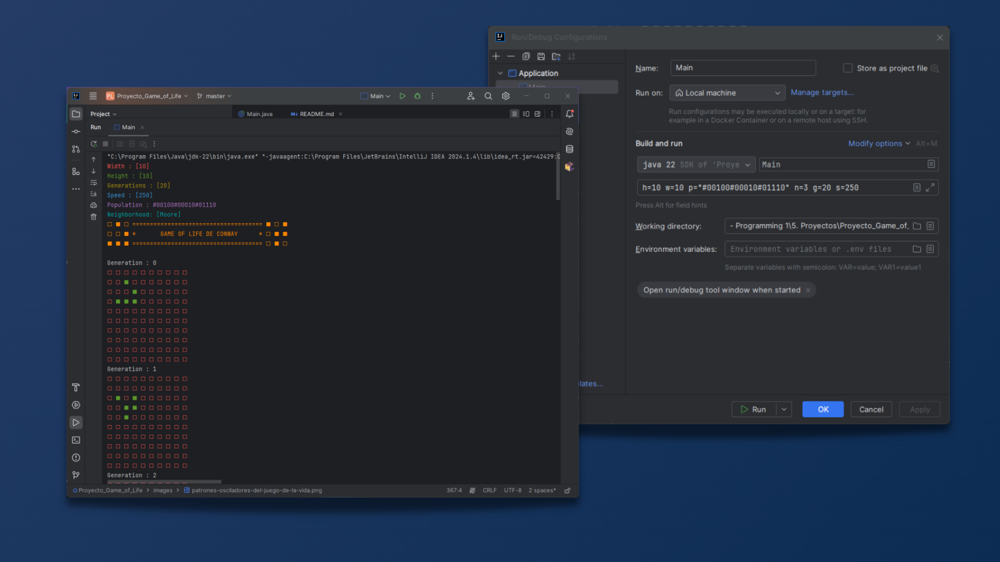

**Población Final después de la ejecución de las generaciones**

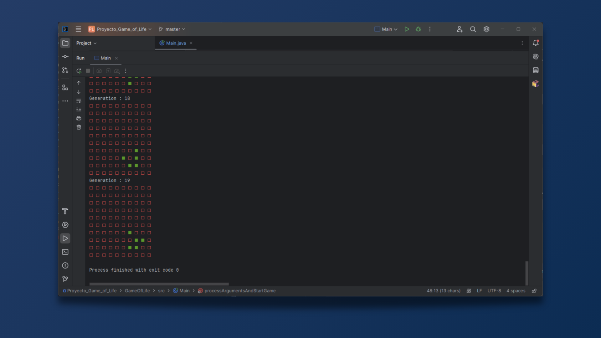

Durante la ejecución, se muestran las generaciones en la consola y las células evolucionan según las reglas del Juego de la Vida. La visualización se actualiza en función de la velocidad definida por el parámetro `s`
